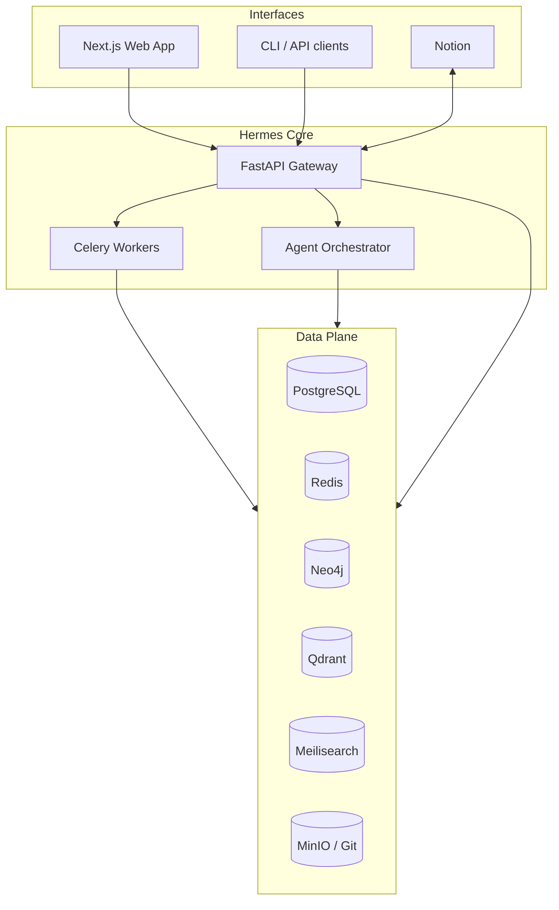

> **SUPERSEDED / ARCHIVING (2026-09-24)**  
> This repository is superseded. Active Agent OS work continues in:  
> - Private control plane: https://github.com/moon-rize-official/agent-os (Moon Rize Nexus)  
> - Public research/specs: https://github.com/moon-rize-official/open-agent-os  
> Hermes Bridge / AI-OS coordination lives with the Moon Rize Hermes plane, not this pre-implementation docs tree.  
> Do not start new work here. This repo is being archived as historical reference only.

# Hermes Workspace OS

> An open-source, self-hostable **AI Workspace Operating System** that unifies project
> management, documentation, repository intelligence, knowledge graphs, research,
> automation, and AI agents into a single, modular platform.

Hermes brings together the best ideas from Notion, GitBook, DeepWiki, Obsidian,
GitHub, Linear, n8n, and LangGraph/OpenHands — but keeps **its own database as the
source of record**. Notion (and other surfaces) are interchangeable *interfaces*, not
the system of record. If any external tool is disconnected, Hermes keeps working.

---

## Status

🚧 **Pre-implementation.** This repository currently contains the **engineering
foundation**: vision, product requirements, architecture, and a milestone-based
implementation roadmap. Application code is built milestone-by-milestone, with
approval gates between milestones.

## Documentation

**Start here:** [`CLAUDE.md`](./CLAUDE.md) → the **[Project Bible](./docs/PROJECT_BIBLE/)**
(the permanent source of truth) → [`docs/PROJECT_MAP.md`](./docs/PROJECT_MAP.md) for fast
orientation.

Repository intelligence & governance:

| Document | Purpose |
|----------|---------|
| [Project Bible](./docs/PROJECT_BIBLE/README.md) | Structured source of truth (11 sections, 50+ docs) |
| [Audit Report](./docs/AUDIT_REPORT.md) | Full repository audit & findings |
| [Project Map](./docs/PROJECT_MAP.md) | Single-page orientation |
| [Missing Information](./docs/MISSING_INFORMATION.md) | Open decisions, gaps, risks |
| [CONTRIBUTING](./CONTRIBUTING.md) · [CHANGELOG](./CHANGELOG.md) | Contribution guide · history |

The deep design **specifications** live in [`/docs`](./docs):

| # | Document | Purpose |
|---|----------|---------|
| 00 | [ROADMAP](./docs/00-ROADMAP.md) | Milestone-based delivery plan |
| 01 | [VISION](./docs/01-VISION.md) | Why Hermes exists |
| 02 | [PRODUCT REQUIREMENTS](./docs/02-PRODUCT_REQUIREMENTS.md) | User-facing functionality |
| 03 | [SYSTEM ARCHITECTURE](./docs/03-SYSTEM_ARCHITECTURE.md) | Services, data, comms flow |
| 04 | [TECH STACK](./docs/04-TECH_STACK.md) | Every technology choice, justified |
| 05 | [DATABASE DESIGN](./docs/05-DATABASE_DESIGN.md) | Postgres + graph + vector schema |
| 06 | [PLUGIN ARCHITECTURE](./docs/06-PLUGIN_ARCHITECTURE.md) | Replaceable providers |
| 07 | [NOTION INTEGRATION](./docs/07-NOTION_INTEGRATION.md) | Two-way sync, not source of record |
| 08 | [GITHUB INTEGRATION](./docs/08-GITHUB_INTEGRATION.md) | Repo/commit/PR/issue sync |
| 09 | [DEEPWIKI SYSTEM](./docs/09-DEEPWIKI_SYSTEM.md) | Automatic repo documentation |
| 10 | [AGENT SYSTEM](./docs/10-AGENT_SYSTEM.md) | AI agent orchestration framework |
| 11 | [KNOWLEDGE GRAPH](./docs/11-KNOWLEDGE_GRAPH.md) | Entities, relationships, GraphRAG |
| 12 | [SEARCH SYSTEM](./docs/12-SEARCH_SYSTEM.md) | Hybrid semantic + keyword search |
| 13 | [FILE INGESTION](./docs/13-FILE_INGESTION.md) | Automatic file processing pipeline |
| 14 | [WORKFLOW SYSTEM](./docs/14-WORKFLOW_SYSTEM.md) | n8n-based automation |
| 15 | [UI DESIGN](./docs/15-UI_DESIGN.md) | Dashboard and project workspace |

## Core Principles

1. **Hermes owns the data.** External tools are replaceable surfaces.
2. **Open-source first.** Integrate mature projects; don't reinvent.
3. **Everything is a plugin.** AI, storage, search, and integrations are swappable.
4. **Modular services.** Each capability is an independently deployable module.
5. **Self-hostable.** Runs entirely on your own infrastructure via Docker Compose.
6. **Type-safe & tested.** Clean architecture, contracts, and tests are non-negotiable.

## High-Level Architecture



## Getting Started (planned)

```bash
git clone https://github.com/cian-omalley/hermes-workspace-os.git
cd hermes-workspace-os
cp .env.example .env      # configure providers
docker compose up -d      # bring up the full stack
```

> The `docker-compose.yml` and application code arrive in Milestone 1+. See the
> [roadmap](./docs/00-ROADMAP.md).

## License

Apache License 2.0 — see [LICENSE](./LICENSE).

## Contributing

Contribution guidelines arrive with Milestone 1. The short version: open an issue to
discuss, work on a branch, keep changes type-safe and tested, and match the
architecture described in `/docs`.
